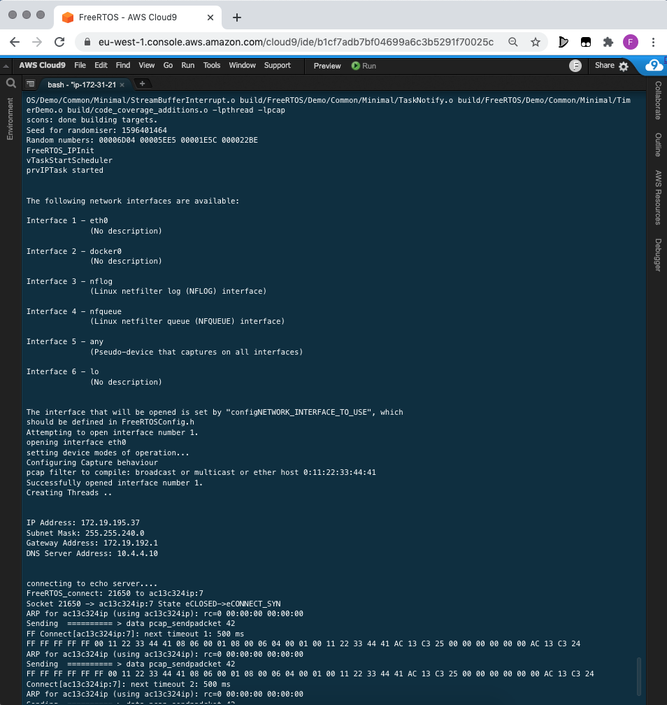
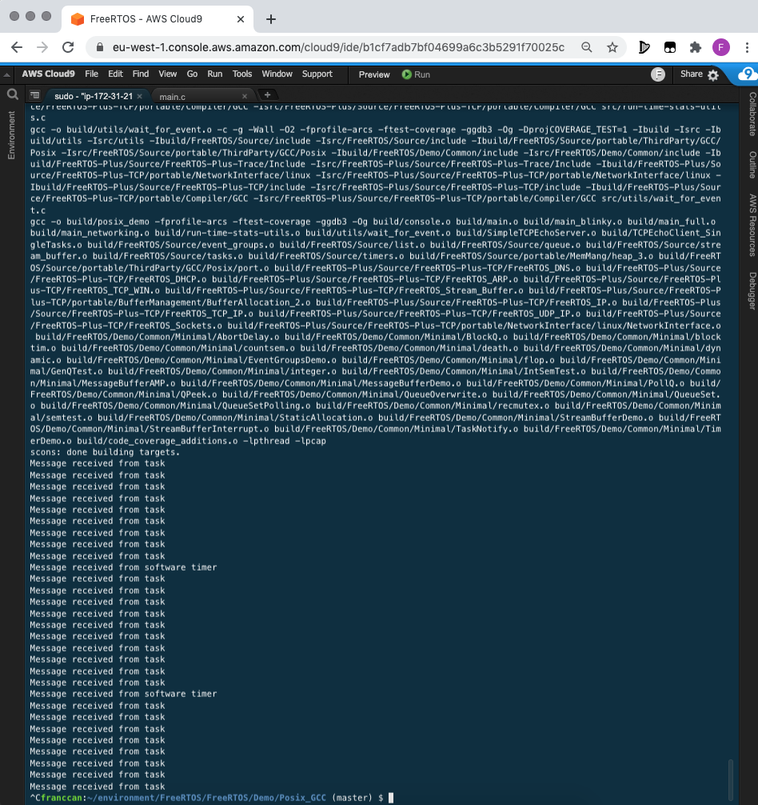
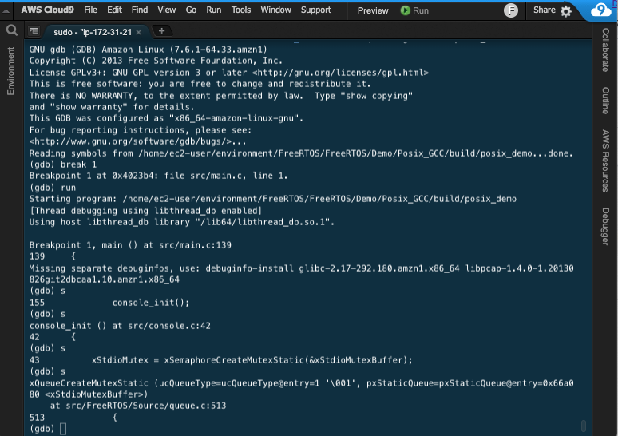

### FreeRTOS POSIX GCC Demo

> This step-by-step guide helps go through the steps required to run the demo. The steps include setting up a new Linux environment, installing dependencies, compiling the source code and executing the demo program.

1. Create a new Amazon Linux Cloud9 environment. 

2. Once the environment is up and running. Go to the terminal and install the building tool SCons and install the libpcal development libraries.

```
sudo pip install scons
sudo yum install libpcap-devel
```

3. Clone the FreeRTOS/FreeRTOS repository recursively. This will make sure you get the latest FreeRTOS branch and the relevant FreeRTOS-Kernel branch 

`git clone --recursive https://github.com/FreeRTOS/FreeRTOS`

4. Compile the project. SCons will compile and link the demo program.

`cd ~/environment/FreeRTOS/FreeRTOS/Demo/Posix_GCC/ && scons --coverage`

5. Run the project

`sudo ~/environment/FreeRTOS/FreeRTOS/Demo/Posix_GCC/build/posix_demo`



6. (Optional) Switch to the "Blinky" demo by changing the flag 'mainCREATE_SIMPLE_BLINKY_DEMO_ONLY' to 1 and 'mainCREATE_TCP_ECHO_TASKS_SINGLE' to 0



7. (Optional) Try out the GNU Debugger. You can set break points using  'break {line}' and use 'n' execute the next line as single instruction or 's' to step into each function line by line.

`sudo gdb ~/environment/FreeRTOS/FreeRTOS/Demo/Posix_GCC/build/posix_demo`

